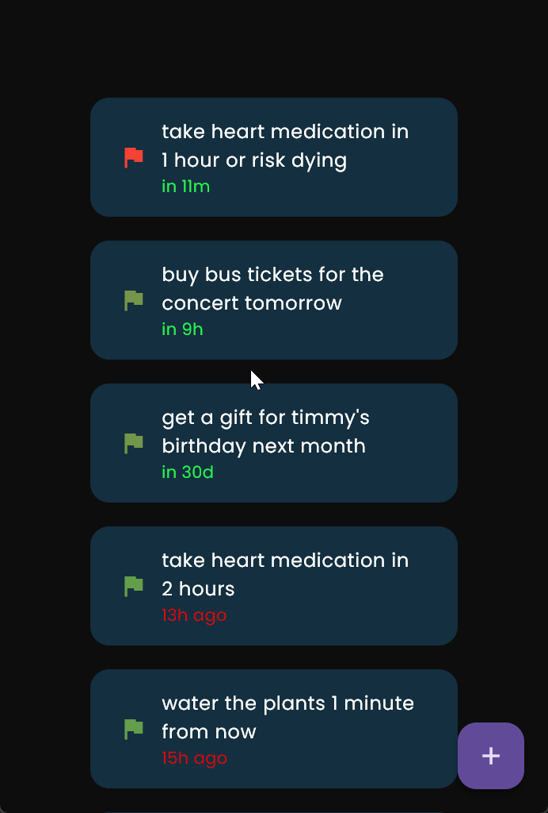

# IntelliTask

## Description

IntelliTask is an AI driven To-Do app. All you do is write the task and submit it. The AI sets the time priority (as seen by the color of the flag - the redder it is, the higher the priority of the task), and the due date and time which is cownted down from with at the bottom of the card.

### Inner workings explanation
Since Supabase doesn't support anonymous authentication, we had to improvise and decide between:
   I. foregoing auth and allowing unauthed users to interact with the backend
   II. go with the classic provider and/or phone/email w/ password signin
   III. set a simple device driven signup to spare the user from having to sign in manually.
We went with III for quick-n-dirty convenient UX while preserving the good practice of having a proper user session.

On startup the app shows a simple material loading indicator while performing the signin/signup in the background using the machine UUID, then loads the home page.

The homepage has an extremely simple UI with 3 elements:
    I. a list of tasks
    II. a + button
    III. a textfield
With the button and textfield appearing and disappearing depending on the state of the other. If the list is empty you are presented with an empty list and UI element indicating so. If the list is populated you'll be taken to the last last item and have it highlighted. 

Since by default the + button has focus, pressing enter or space will make the text field for entering the task to appear with it immediatelly now having the focus.

When you're done writing the task, you may now press enter to have the task sent to the server where it is added to the tasks table and triggers an edge function to be sent and processed by an AI (in this case the OpenAI gpt-3.5-turbo model) and assigned a priority and a due date/time. All updates are updated in the app via Supabase realtime.

If the task is deemed uncategorizeble by the AI, it renders it invalid, it's indicated as such in the app, and then gets deleted.

For state management I resort to my default go-to of Riverpod+Hooks.

Demo:

## Notes

I originally wanted to use vertex ai - but it doesn't have vanilla api endpoints and supabase lacks the runtimes supported by Appwrite and Firebase (python in this case for which vertex ai has an official sdk).

Then I tried dart edge functions to use with openai -- but it's too experimental to be useable as of yet.

Ultimately had to resort to using vanilla Edge functions with Deno and TS.

### future features
[ ] - Automatically add local notifications
[ ] -  add related pics based on the context of the task?